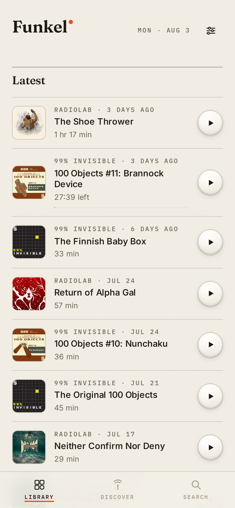
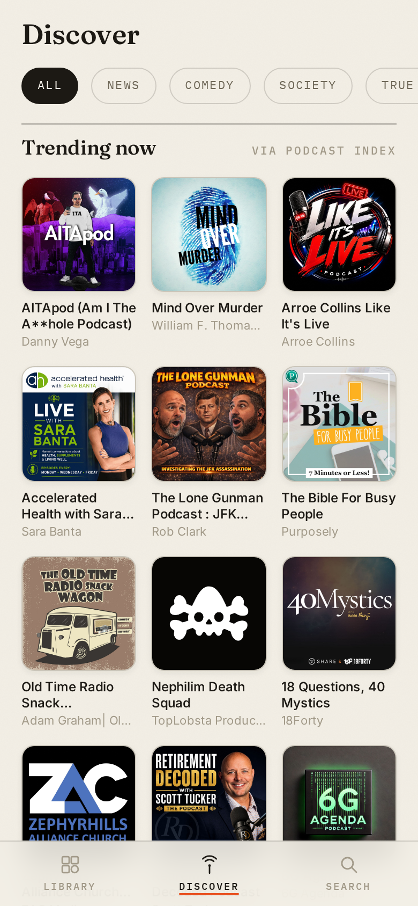
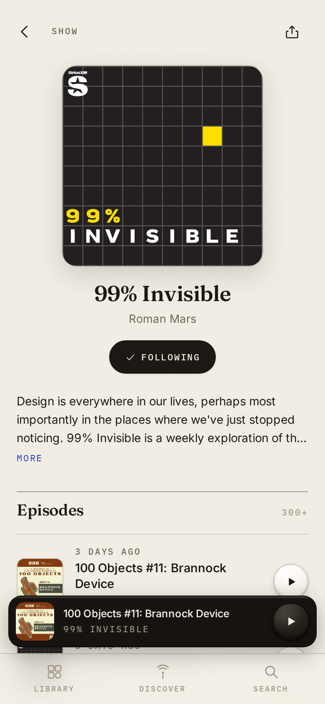
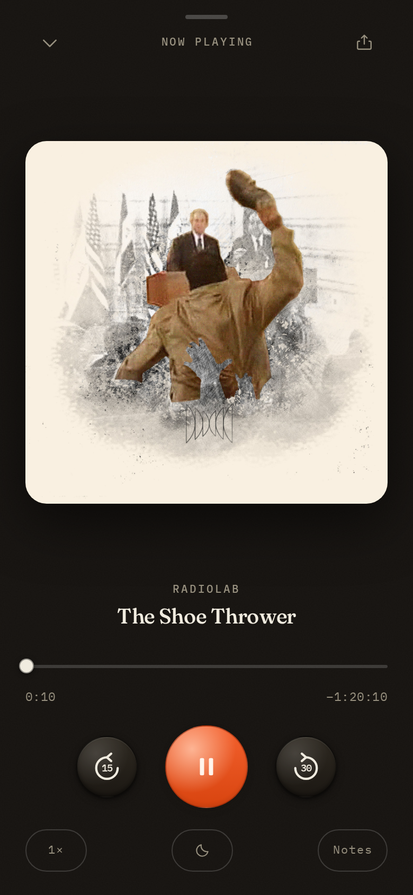

<p align="center">
  
</p>

<h1 align="center">Funkel</h1>

<p align="center"><em>A quiet, private podcast player for the web.</em></p>

<p align="center">
  
  
  
  
</p>

Funkel is a self-hostable, mobile-first podcast app built on the open
[Podcast Index](https://podcastindex.org).

## Features

- **Follow shows, track progress** — subscriptions, resume-where-you-left-off,
  a "Continue" shelf, a latest-episodes feed, mark played. State lives
  server-side under an anonymous identity; optionally claim a sync name +
  passphrase to carry your library across devices. No email, ever.
- **Full player** — background audio, lock-screen / hardware controls via the
  Media Session API (play, pause, ±seek, scrub, artwork), playback speed,
  sleep timer, ±15/30 s skips, swipe-down player sheet, persistent mini player.
- **Share** — every episode shares its podcastindex.org URL through the native
  share sheet (clipboard fallback).
- **Ad-tech blocking** — enclosure URLs are unwrapped server-side before
  fetching: Podtrac, Chartable, Podsights, Podscribe, Magellan, the Spotify
  prefix and friends are stripped, so ad-attribution trackers never see the
  listener at all.
- **Privacy relay** — the browser only ever talks to your Funkel server. All
  artwork and audio are proxied (with HTTP Range support for instant seeking).
  With Decodo configured, the server's own outbound traffic exits through a
  residential ISP proxy, so podcast hosts see neither the listener nor the
  operator. No analytics, no third-party requests, self-hosted fonts.
- **PWA** — installable, app-shell + artwork caching, safe-area aware,
  standalone display.

## Stack

- `server/` — Node 22 + Express, better-sqlite3 (WAL). PodcastIndex client
  with signed requests and an in-memory TTL cache; media proxy; tracker
  stripper; cookie sessions (httpOnly, anonymous by default, scrypt
  passphrases). One container, one volume, no other services.
- `web/` — React 18 + Vite PWA. Zustand for state, a single global `<audio>`
  element outside React, hand-rolled CSS (no framework).

## Development

```bash
cp .env.example .env    # fill in PodcastIndex keys (Decodo optional)
npm install
npm run dev             # server :3000 + vite :5173 (proxied /api)
```

## Deploying on Coolify

1. Push this repository to a Git host Coolify can reach.
2. **New Resource → Application**, pick the repo. Coolify detects the
   `Dockerfile` build pack automatically (the app listens on port 3000).
3. **Environment variables**: set `PODCASTINDEX_KEY`, `PODCASTINDEX_SECRET`,
   `DB_ENCRYPTION_KEY` (generate with `openssl rand -hex 32`; set it before
   the first deploy), and optionally `DECODO_USERNAME` / `DECODO_PASSWORD`.
4. **Persistent storage**: add a volume mounted at `/data`
   (this holds `funkel.db` — subscriptions, progress, accounts).
5. Deploy. The health check is `GET /healthz`. Serve it over HTTPS (Coolify's
   default proxy does this) — required for the share sheet, PWA install and
   lock-screen controls.

## Privacy model

| Party | What they see |
| --- | --- |
| Podcast hosts / CDNs | Requests from your server (or the Decodo exit if configured). Never the listener. |
| Ad-tech redirects (Podtrac …) | Nothing — stripped before fetch. |
| Podcast Index API | Server-side queries only; keys never reach the browser. |
| Your server | Anonymous UUID sessions; optional username + scrypt-hashed passphrase. No email, no IP logging. |
| Someone with disk access to your server | With `DB_ENCRYPTION_KEY` set, an unreadable ChaCha20-Poly1305-encrypted database file. The key lives only in the platform's secret store. |
| Third parties in the browser | None. Same-origin requests only, fonts self-hosted. |

Data from [Podcast Index](https://podcastindex.org).
